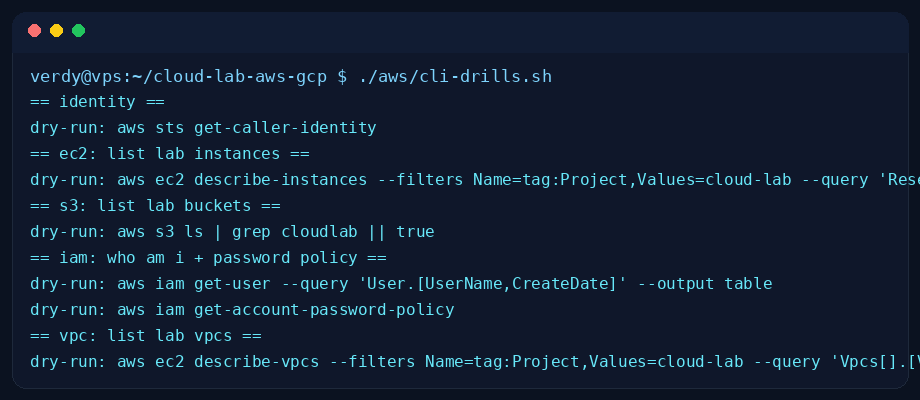
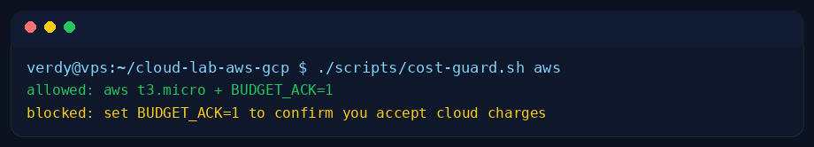

# cloud-lab-aws-gcp

Cloud fundamentals as code: VPC + EC2 + S3 (AWS) and VPC + Compute + Cloud
Storage (GCP) from one repo, with a billing guard so a lab never becomes a
surprise invoice. Honest scope: lab-grade Terraform + AWS CLI drills, not
production client infra.

## Quickstart (fork-friendly, costs nothing until apply)

```bash
git clone https://github.com/verdynordsten/cloud-lab-aws-gcp.git
cd cloud-lab-aws-gcp

cp aws/.env.example aws/.env        # AWS_PROFILE + region, no keys in repo
cp gcp/.env.example gcp/.env        # GCP_PROJECT + region

bash tests/test.sh                  # self-test: terraform fmt/validate-shape,
                                    # CLI drills in dry-run, billing guard

# real lab (needs your own AWS/GCP account):
cd aws && terraform init && terraform plan    # review costs first
```

## Layout

| Path | What |
|---|---|
| `aws/main.tf` | VPC, public subnet, SG (ssh/http), EC2 + S3 |
| `aws/variables.tf` | region, names, instance type, budgets |
| `aws/userdata.sh` | nginx bootstrap on first boot |
| `aws/cli-drills.sh` | s3/ec2/iam read-only drills + dry-run flags |
| `gcp/main.tf` | VPC, subnet, firewall, Compute instance, bucket |
| `gcp/variables.tf` | project, region, machine type |
| `scripts/cost-guard.sh` | refuses `apply` unless BUDGET_ACK=1 + caps instance size |
| `scripts/destroy-lab.sh` | teardown with double confirm |
| `tests/test.sh` | fmt check, tfvars validation, dry-run drills |

## Billing guard

`scripts/cost-guard.sh` blocks `terraform apply` when:
- `BUDGET_ACK` is not `1` (you must acknowledge cost explicitly), or
- instance/machine type is not on the free-tier/lab allowlist.

`terraform destroy` right after each lab session: `scripts/destroy-lab.sh`.

## Evidence (real run)



